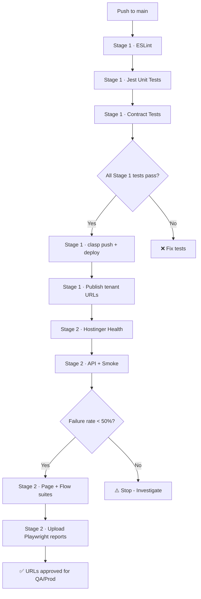

# GitHub Actions Deployment Setup

**Deploy MVP Event Toolkit via GitHub Actions CI/CD Pipeline**

---

## 🔐 Required GitHub Secrets

Before GitHub Actions can deploy, add these secrets to **Settings → Secrets and variables → Actions**:

### 1. `OAUTH_CREDENTIALS`
- Copy the entire contents of `~/.clasprc.json` after running `npx clasp login`
- Stage 1 writes this JSON to `~/.clasprc.json` on the runner so `npx clasp push/deploy` can run headlessly

### 2. `DEPLOYMENT_ID`
- Copy the ID shown in Apps Script → Deploy → Manage deployments (format: `AKfycb...`)
- Must be the deployment you created with **Execute as: Me** + **Access: Anyone, even anonymous** via `./fix-anonymous-access.sh`

### 3. `SCRIPT_ID`
- Value: `1YO4apLOQoAIh208AcAqWO3pWtx_O3yas_QC4z-pkurgMem9UgYOsp86l`

### 4. `ADMIN_KEY_ROOT`
- Value: The `adminSecret` for the `root` tenant (Stage 2 API/smoke tests use it)

### Optional
- `BASE_URL_QA` if QA isn’t `https://zeventbooks.com`
- `PLAYWRIGHT_RETRIES` to override the default retry logic

> 💡 Run `npm run deploy:verify-secrets` locally to confirm all secrets are populated before pushing to `main`.

## 🚀 Trigger Deployment

### Option 1: Merge to Main (Recommended)

The workflow is configured to deploy only on pushes to `main` branch:

```bash
# Create a pull request
gh pr create --title "Deploy comprehensive architecture review" \
  --body "Deploy all test infrastructure and architecture improvements"

# Or if gh CLI not installed, create PR at:
# https://github.com/zeventbooks/MVP-EVENT-TOOLKIT/compare/main...claude/comprehensive-architecture-review-011CUyEGnrsjfBCKLd65ysL6
```

After PR is merged:
- ✅ Linting runs
- ✅ Unit tests run (94 tests)
- ✅ Contract tests run
- ✅ Code deploys to Apps Script
- ✅ E2E tests run against deployed URL
- ✅ Test reports uploaded

### Option 2: Push to Current Branch (Testing)

To test the workflow on your current branch (without deploying):

```bash
# Push to trigger lint + unit tests + contract tests
git push origin claude/comprehensive-architecture-review-011CUyEGnrsjfBCKLd65ysL6
```

**Note:** Deploy and E2E tests will be **skipped** because workflow only deploys on `main` branch (see `.github/workflows/ci.yml` line 75)

### Option 3: Enable Deploy on Claude Branches

If you want to test deployment on your current branch, modify the workflow:

```yaml
# In .github/workflows/ci.yml
# Change line 75 from:
if: github.ref == 'refs/heads/main' && github.event_name == 'push'

# To:
if: (github.ref == 'refs/heads/main' || startsWith(github.ref, 'refs/heads/claude/')) && github.event_name == 'push'
```

Then push again to trigger full deployment on claude/ branches.

---

## 📊 Monitor Deployment

### View Workflow Progress

1. Go to: https://github.com/zeventbooks/MVP-EVENT-TOOLKIT/actions
2. Click on the latest workflow run
3. Watch each job complete:
   - **Lint Code** (~ 30s)
   - **Run Tests** (~ 45s)
   - **Contract Tests** (~ 30s)
   - **Deploy to Apps Script** (~ 1-2 min) ← Only on main branch
   - **E2E Tests on Deployed URL** (~ 1-2 min) ← Only on main branch
   - **Quality Gate Check** (~ 5s)

### Download Test Reports

After workflow completes:

1. Scroll to **Artifacts** section at bottom of workflow run
2. Download **playwright-report.zip**
3. Unzip and open `index.html` to view detailed E2E test results

---

## 🔍 Verify Secrets Are Set

Check if secrets are configured:

```bash
# List repository secrets (requires gh CLI with admin permissions)
gh secret list

# Expected output:
# ADMIN_KEY_ROOT     Updated 2025-11-10
# DEPLOYMENT_ID      Updated 2025-11-10
# OAUTH_CREDENTIALS  Updated 2025-11-10
# SCRIPT_ID          Updated 2025-11-10
```

Or check manually:
1. Go to: https://github.com/zeventbooks/MVP-EVENT-TOOLKIT/settings/secrets/actions
2. Verify all 3 secrets are listed

---

## 🐛 Troubleshooting

### Issue 1: "OAUTH_CREDENTIALS is not set"

**Solution:** Add the secret at https://github.com/zeventbooks/MVP-EVENT-TOOLKIT/settings/secrets/actions

### Issue 2: "clasp push failed - Unauthorized"

**Cause:** Invalid or expired `OAUTH_CREDENTIALS`

**Solution:**
```bash
# Re-login to refresh credentials
clasp logout
clasp login

# Update secret with new credentials
cat ~/.clasprc.json
# Copy output and update OAUTH_CREDENTIALS secret
```

### Issue 3: "Deploy job skipped"

**Cause:** Workflow only deploys on `main` branch

**Solution:** Either:
- Merge your branch to main
- Or modify workflow to deploy on claude/** branches (see Option 3 above)

### Issue 4: "E2E tests failed - Cannot find BASE_URL"

**Cause:** Stage 2 could not download the Stage 1 artifact (no deployment URL) or `BASE_URL_QA` secret missing when testing non-default domains

**Solution:**
1. Check Stage 1 logs to confirm deployment succeeded and `deployment-info/deployment-url.txt` uploaded
2. Re-run Stage 2 with the same artifact or provide `deployment_url` via workflow dispatch
3. If QA domain differs, set `BASE_URL_QA`

### Issue 5: "Admin key invalid"

**Cause:** ADMIN_KEY_ROOT secret doesn't match Config.gs

**Solution:**
1. Check actual admin secret in Config.gs line 17
2. Update ADMIN_KEY_ROOT secret with correct value

---

## 📋 Pre-Deployment Checklist

Before merging to main and deploying:

- [ ] **OAUTH_CREDENTIALS** secret configured in GitHub
- [ ] **DEPLOYMENT_ID** secret configured in GitHub
- [ ] **SCRIPT_ID** secret configured in GitHub
- [ ] **ADMIN_KEY_ROOT** secret configured in GitHub
- [ ] Admin secrets changed in `Config.gs` (not CHANGE_ME_*)
- [ ] All tests passing locally (`npm test`)
- [ ] Linting passing (`npm run lint`)
- [ ] `.clasp.json` has correct scriptId
- [ ] Branch pushed to GitHub
- [ ] Ready to merge to main

---

## 🎯 Expected Workflow Flow



---

## 🚀 Quick Start (All Steps)

```bash
# 1. Set up GitHub Secrets (one-time setup)
# Go to: https://github.com/zeventbooks/MVP-EVENT-TOOLKIT/settings/secrets/actions
# Add: OAUTH_CREDENTIALS, DEPLOYMENT_ID, SCRIPT_ID, ADMIN_KEY_ROOT

# 2. Create Pull Request
gh pr create --title "Deploy architecture review" --body "Deploy test infrastructure"

# 3. Merge PR (or via GitHub UI)
gh pr merge --squash

# 4. Watch deployment
# https://github.com/zeventbooks/MVP-EVENT-TOOLKIT/actions

# 5. Download test reports after completion
# Scroll to Artifacts → Download playwright-report.zip
```

---

## 📈 Post-Deployment

After successful deployment:

1. **Get Deployment URL** from GitHub Actions logs
2. **Test manually:**
   ```bash
   export BASE_URL="<URL from logs>"
   ./verify-deployment.sh
   ```
3. **Configure custom domain** (zeventbooks.io)
4. **Set up monitoring** (UptimeRobot, etc.)
5. **Share with stakeholders**

---

## 📞 Need Help?

- **GitHub Actions Docs:** https://docs.github.com/en/actions
- **Clasp Documentation:** https://github.com/google/clasp
- **Workflow File:** `.github/workflows/ci.yml`
- **View Latest Run:** https://github.com/zeventbooks/MVP-EVENT-TOOLKIT/actions/runs/19218101242

---

**Ready to deploy! 🚀**

Once secrets are configured, just merge to main and GitHub Actions will handle everything automatically.
