# GitHub Actions Deployment Setup

**Deploy MVP Event Toolkit via GitHub Actions CI/CD Pipeline**

---

## 🔐 Required GitHub Secrets

Before GitHub Actions can deploy, you need to add 3 secrets to your repository:

### 1. Navigate to GitHub Secrets

1. Go to: https://github.com/zeventbooks/MVP-EVENT-TOOLKIT/settings/secrets/actions
2. Click **New repository secret** for each of the following:

---

### 2. Add CLASPRC_JSON Secret

**Name:** `CLASPRC_JSON`

**Value:** Your Google Apps Script credentials

**How to get it:**

```bash
# Login to Google Apps Script (if not already logged in)
clasp login

# Get the credentials file content
cat ~/.clasprc.json
```

Copy the **entire JSON output** and paste it as the secret value.

Example format:
```json
{
  "token": {
    "access_token": "ya29.a0AfH6...",
    "refresh_token": "1//0g...",
    "scope": "https://www.googleapis.com/auth/...",
    "token_type": "Bearer",
    "expiry_date": 1234567890123
  },
  "oauth2ClientSettings": {
    "clientId": "...",
    "clientSecret": "...",
    "redirectUri": "..."
  },
  "isLocalCreds": false
}
```

**⚠️ Important:** Make sure it's valid JSON (no newlines, properly formatted)

---

### 3. Add SCRIPT_ID Secret

**Name:** `SCRIPT_ID`

**Value:** `1YO4apLOQoAIh208AcAqWO3pWtx_O3yas_QC4z-pkurgMem9UgYOsp86l`

This is your Google Apps Script project ID (already in `.clasp.json`)

---

### 4. Add ADMIN_KEY_ROOT Secret

**Name:** `ADMIN_KEY_ROOT`

**Value:** Your admin secret for the 'root' tenant

**How to get it:**

```bash
# Check Config.gs line 17
grep "adminSecret" Config.gs | head -1
```

Copy the actual secret value (not `CHANGE_ME_root` - you should have changed this!)

---

## 🚀 Trigger Deployment

### Option 1: Merge to Main (Recommended)

The workflow is configured to deploy only on pushes to `main` branch:

```bash
# Create a pull request
gh pr create --title "Deploy comprehensive architecture review" \
  --body "Deploy all test infrastructure and architecture improvements"

# Or if gh CLI not installed, create PR at:
# https://github.com/zeventbooks/MVP-EVENT-TOOLKIT/compare/main...claude/comprehensive-architecture-review-011CUyEGnrsjfBCKLd65ysL6
```

After PR is merged:
- ✅ Linting runs
- ✅ Unit tests run (94 tests)
- ✅ Contract tests run
- ✅ Code deploys to Apps Script
- ✅ E2E tests run against deployed URL
- ✅ Test reports uploaded

### Option 2: Push to Current Branch (Testing)

To test the workflow on your current branch (without deploying):

```bash
# Push to trigger lint + unit tests + contract tests
git push origin claude/comprehensive-architecture-review-011CUyEGnrsjfBCKLd65ysL6
```

**Note:** Deploy and E2E tests will be **skipped** because workflow only deploys on `main` branch (see `.github/workflows/ci.yml` line 75)

### Option 3: Enable Deploy on Claude Branches

If you want to test deployment on your current branch, modify the workflow:

```yaml
# In .github/workflows/ci.yml
# Change line 75 from:
if: github.ref == 'refs/heads/main' && github.event_name == 'push'

# To:
if: (github.ref == 'refs/heads/main' || startsWith(github.ref, 'refs/heads/claude/')) && github.event_name == 'push'
```

Then push again to trigger full deployment on claude/ branches.

---

## 📊 Monitor Deployment

### View Workflow Progress

1. Go to: https://github.com/zeventbooks/MVP-EVENT-TOOLKIT/actions
2. Click on the latest workflow run
3. Watch each job complete:
   - **Lint Code** (~ 30s)
   - **Run Tests** (~ 45s)
   - **Contract Tests** (~ 30s)
   - **Deploy to Apps Script** (~ 1-2 min) ← Only on main branch
   - **E2E Tests on Deployed URL** (~ 1-2 min) ← Only on main branch
   - **Quality Gate Check** (~ 5s)

### Download Test Reports

After workflow completes:

1. Scroll to **Artifacts** section at bottom of workflow run
2. Download **playwright-report.zip**
3. Unzip and open `index.html` to view detailed E2E test results

---

## 🔍 Verify Secrets Are Set

Check if secrets are configured:

```bash
# List repository secrets (requires gh CLI with admin permissions)
gh secret list

# Expected output:
# ADMIN_KEY_ROOT    Updated 2025-11-10
# CLASPRC_JSON      Updated 2025-11-10
# SCRIPT_ID         Updated 2025-11-10
```

Or check manually:
1. Go to: https://github.com/zeventbooks/MVP-EVENT-TOOLKIT/settings/secrets/actions
2. Verify all 3 secrets are listed

---

## 🐛 Troubleshooting

### Issue 1: "CLASPRC_JSON is not set"

**Solution:** Add the secret at https://github.com/zeventbooks/MVP-EVENT-TOOLKIT/settings/secrets/actions

### Issue 2: "clasp push failed - Unauthorized"

**Cause:** Invalid or expired CLASPRC_JSON

**Solution:**
```bash
# Re-login to refresh credentials
clasp logout
clasp login

# Update secret with new credentials
cat ~/.clasprc.json
# Copy output and update CLASPRC_JSON secret
```

### Issue 3: "Deploy job skipped"

**Cause:** Workflow only deploys on `main` branch

**Solution:** Either:
- Merge your branch to main
- Or modify workflow to deploy on claude/** branches (see Option 3 above)

### Issue 4: "E2E tests failed - Cannot find BASE_URL"

**Cause:** Deploy job didn't output URL correctly

**Solution:** Check deploy job logs for deployment URL, then manually set it in e2e-tests job

### Issue 5: "Admin key invalid"

**Cause:** ADMIN_KEY_ROOT secret doesn't match Config.gs

**Solution:**
1. Check actual admin secret in Config.gs line 17
2. Update ADMIN_KEY_ROOT secret with correct value

---

## 📋 Pre-Deployment Checklist

Before merging to main and deploying:

- [ ] **CLASPRC_JSON** secret configured in GitHub
- [ ] **SCRIPT_ID** secret configured in GitHub
- [ ] **ADMIN_KEY_ROOT** secret configured in GitHub
- [ ] Admin secrets changed in `Config.gs` (not CHANGE_ME_*)
- [ ] All tests passing locally (`npm test`)
- [ ] Linting passing (`npm run lint`)
- [ ] `.clasp.json` has correct scriptId
- [ ] Branch pushed to GitHub
- [ ] Ready to merge to main

---

## 🎯 Expected Workflow Flow

```mermaid
graph TD
    A[Push to main] --> B[Lint Code]
    B --> C[Run Unit Tests - 94 tests]
    C --> D[Run Contract Tests]
    D --> E{All tests pass?}
    E -->|Yes| F[Deploy to Apps Script]
    E -->|No| G[❌ Fail - Fix tests]
    F --> H[Get Deployment URL]
    H --> I[Run E2E Tests - 15 scenarios]
    I --> J[Upload Test Reports]
    J --> K[✅ Success - Deployment Live]
```



---

## 🚀 Quick Start (All Steps)

```bash
# 1. Set up GitHub Secrets (one-time setup)
# Go to: https://github.com/zeventbooks/MVP-EVENT-TOOLKIT/settings/secrets/actions
# Add: CLASPRC_JSON, SCRIPT_ID, ADMIN_KEY_ROOT

# 2. Create Pull Request
gh pr create --title "Deploy architecture review" --body "Deploy test infrastructure"

# 3. Merge PR (or via GitHub UI)
gh pr merge --squash

# 4. Watch deployment
# https://github.com/zeventbooks/MVP-EVENT-TOOLKIT/actions

# 5. Download test reports after completion
# Scroll to Artifacts → Download playwright-report.zip
```

---

## 📈 Post-Deployment

After successful deployment:

1. **Get Deployment URL** from GitHub Actions logs
2. **Test manually:**
   ```bash
   export BASE_URL="<URL from logs>"
   ./verify-deployment.sh
   ```
3. **Configure custom domain** (zeventbooks.io)
4. **Set up monitoring** (UptimeRobot, etc.)
5. **Share with stakeholders**

---

## 📞 Need Help?

- **GitHub Actions Docs:** https://docs.github.com/en/actions
- **Clasp Documentation:** https://github.com/google/clasp
- **Workflow File:** `.github/workflows/ci.yml`
- **View Latest Run:** https://github.com/zeventbooks/MVP-EVENT-TOOLKIT/actions/runs/19218101242

---

**Ready to deploy! 🚀**

Once secrets are configured, just merge to main and GitHub Actions will handle everything automatically.
