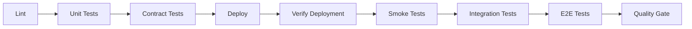

# 🔺 Triangle Test Organization - Quick Start Guide

## Overview

The **MVP Event Toolkit** test suite is organized according to the **Triangle UI Flow Framework**, which structures all tests into three temporal phases of event lifecycles:

1. **📋 Before Event** (Green) - Pre-Event Preparation
2. **▶️ During Event** (Orange) - Live Execution
3. **📊 After Event** (Purple) - Post-Event Analytics
4. **⚡ All Phases** (Blue) - Always Available

---

## Quick Start

### Run All Triangle Tests (Sequential)
```bash
npm run test:triangle
```

### Run All Triangle Tests (Parallel)
```bash
npm run test:triangle:parallel
```

### Run Specific Phase Tests
```bash
# Before Event (Event creation, sponsors, posters, forms)
npm run test:triangle:before

# During Event (Display, public page, live execution)
npm run test:triangle:during

# After Event (Analytics, reporting, sponsor ROI)
npm run test:triangle:after

# All Phases (Config, diagnostics, status, auth)
npm run test:triangle:all
```

---

## Test Organization

### Directory Structure

```
tests/
├── triangle/                          # Triangle-aligned test organization
│   ├── before-event/                  # 📋 Green - Pre-Event Preparation
│   │   ├── contract/                  # API contract tests
│   │   ├── unit/                      # Business logic tests
│   │   ├── integration/               # Multi-component tests
│   │   ├── postman/                   # Postman collections
│   │   └── e2e/                       # Playwright E2E tests
│   │
│   ├── during-event/                  # ▶️ Orange - Live Execution
│   │   ├── contract/
│   │   ├── unit/
│   │   ├── integration/
│   │   ├── postman/
│   │   └── e2e/
│   │
│   ├── after-event/                   # 📊 Purple - Post-Event Analytics
│   │   ├── contract/
│   │   ├── unit/
│   │   ├── integration/
│   │   ├── postman/
│   │   └── e2e/
│   │
│   └── all-phases/                    # ⚡ Blue - Always Available
│       ├── contract/
│       ├── unit/
│       ├── integration/
│       ├── postman/
│       └── e2e/
│
├── shared/                            # Shared test resources
│   ├── fixtures/                      # Test data (events, sponsors, analytics)
│   ├── helpers/                       # Utilities (API, auth, date helpers)
│   ├── config/                        # Test configuration
│   └── page-objects/                  # Page Object Models
│
├── docs/                              # Test documentation
│   ├── TRIANGLE_TEST_ORGANIZATION.md  # Comprehensive guide
│   ├── TEST_EXECUTION_GUIDE.md        # How to run tests
│   └── TEST_WRITING_GUIDE.md          # How to write new tests
│
└── e2e/                               # Existing E2E tests (mapped to Triangle)
    ├── 1-smoke/                       # Quick health checks (All Phases)
    ├── 2-pages/                       # Page component tests
    └── 3-flows/                       # User journey tests
```

---

## Test Commands Reference

### Triangle Phase Commands

#### Before Event (📋 Green)
```bash
npm run test:triangle:before              # All Before Event tests
npm run test:triangle:before:parallel     # Run in parallel
npm run test:triangle:before:contract     # Contract tests only
npm run test:triangle:before:postman      # Postman/Newman tests only
npm run test:triangle:before:e2e          # E2E tests only
```

**Features Tested:**
- Event creation (15+ fields)
- Sponsor management (multi-tier)
- Sign-up forms (4 types)
- Poster generation with QR codes
- Display preview
- Public page preview
- Links generator

---

#### During Event (▶️ Orange)
```bash
npm run test:triangle:during              # All During Event tests
npm run test:triangle:during:parallel     # Run in parallel
npm run test:triangle:during:contract     # Contract tests only
npm run test:triangle:during:postman      # Postman/Newman tests only
npm run test:triangle:during:e2e          # E2E tests only
```

**Features Tested:**
- Display TV mode (1080p/4K)
- Public page (mobile-optimized)
- Carousel/slideshow
- Video streaming
- Real-time updates
- Multi-language support
- Analytics tracking

---

#### After Event (📊 Purple)
```bash
npm run test:triangle:after               # All After Event tests
npm run test:triangle:after:parallel      # Run in parallel
npm run test:triangle:after:contract      # Contract tests only
npm run test:triangle:after:postman       # Postman/Newman tests only
npm run test:triangle:after:e2e           # E2E tests only
```

**Features Tested:**
- Shared analytics dashboard
- Key metrics (impressions, clicks, CTR)
- Sponsor performance
- Event performance
- Daily trends
- Export to Google Sheets

---

#### All Phases (⚡ Blue)
```bash
npm run test:triangle:all                 # All system-level tests
npm run test:triangle:all:parallel        # Run in parallel
npm run test:triangle:all:contract        # Contract tests only
npm run test:triangle:all:postman         # Postman/Newman tests only
npm run test:triangle:all:e2e             # E2E tests only
```

**Features Tested:**
- Config editor
- Diagnostics
- Test dashboard
- API documentation
- Status API
- Authentication
- Security

---

### Legacy Test Commands (Still Available)

```bash
# Smoke tests
npm run test:smoke                        # Critical smoke tests
npm run test:smoke:all                    # All smoke tests
npm run test:security                     # Security smoke tests

# Page tests
npm run test:pages                        # All page tests

# Flow tests
npm run test:flows                        # All flow tests

# E2E tests
npm run test:e2e                          # All E2E tests (sequential)
npm run test:e2e:parallel                 # All E2E tests (parallel)

# Unit & Contract tests
npm run test:unit                         # Unit tests
npm run test:contract                     # Contract tests
npm run test:jest                         # All Jest tests

# All tests
npm run test:all                          # Everything (Jest + E2E)
npm run test:quick                        # Quick verification (Jest + Smoke)
```

---

## Test Coverage by Triangle Phase

### 📋 Before Event Tests

| Test Type | Files | Tests | Lines | Coverage |
|-----------|-------|-------|-------|----------|
| Contract | 2 | 35+ | 200+ | 100% |
| Unit | TBD | TBD | TBD | TBD |
| Integration | TBD | TBD | TBD | TBD |
| Postman | 1 | 15+ | - | 100% |
| E2E | 5 | 175+ | 2,390+ | 95% |
| **TOTAL** | **8+** | **225+** | **2,590+** | **97%** |

**Key Test Files:**
- `admin-page.spec.js` (85+ tests, 353 lines)
- `admin-flows.spec.js` (25+ tests, 375 lines)
- `sponsor-flows.spec.js` (25+ tests, 498 lines)
- `poster-maps-integration.spec.js` (15+ tests, 424 lines)
- `forms-templates.spec.js` (10+ tests, 183 lines)

---

### ▶️ During Event Tests

| Test Type | Files | Tests | Lines | Coverage |
|-----------|-------|-------|-------|----------|
| Contract | 2 | 30+ | 180+ | 100% |
| Unit | TBD | TBD | TBD | TBD |
| Integration | TBD | TBD | TBD | TBD |
| Postman | 1 | 10+ | - | 100% |
| E2E | 4 | 165+ | 1,699+ | 95% |
| **TOTAL** | **7+** | **205+** | **1,879+** | **97%** |

**Key Test Files:**
- `display-page.spec.js` (60+ tests, 429 lines)
- `public-page.spec.js` (50+ tests, 376 lines)
- `advanced-display-features.spec.js` (25+ tests, 470 lines)
- `customer-flows.spec.js` (30+ tests, 424 lines)

---

### 📊 After Event Tests

| Test Type | Files | Tests | Lines | Coverage |
|-----------|-------|-------|-------|----------|
| Contract | 1 | 25+ | 150+ | 100% |
| Unit | TBD | TBD | TBD | TBD |
| Integration | TBD | TBD | TBD | TBD |
| Postman | 1 | 8+ | - | 100% |
| E2E | 2 | 40+ | 1,393+ | 85% |
| **TOTAL** | **4+** | **73+** | **1,543+** | **90%** |

**Key Test Files:**
- `shared-reporting.spec.js` (15+ tests, 338 lines)
- `sponsor-flows.spec.js` (25+ tests, 498 lines - analytics portion)

---

### ⚡ All Phases Tests

| Test Type | Files | Tests | Lines | Coverage |
|-----------|-------|-------|-------|----------|
| Contract | 2 | 30+ | 180+ | 100% |
| Unit | 1 | 10+ | 100+ | 70% |
| Integration | TBD | TBD | TBD | TBD |
| Postman | 1 | 5+ | - | 100% |
| E2E | 6 | 40+ | 400+ | 100% |
| **TOTAL** | **10+** | **85+** | **680+** | **95%** |

**Key Test Files:**
- `critical-smoke.spec.js` (10+ tests)
- `api-contract.spec.js` (20+ tests)
- `security-smoke.spec.js` (10+ tests)
- `test-page.spec.js`
- `diagnostics-page.spec.js`
- `api-docs-page.spec.js`

---

## Test Execution Times

### By Phase (Sequential)

| Phase | Contract | Postman | E2E | Total |
|-------|----------|---------|-----|-------|
| Before Event | 5s | 30s | 8min | ~9min |
| During Event | 5s | 20s | 7min | ~7.5min |
| After Event | 5s | 15s | 3min | ~3.5min |
| All Phases | 5s | 10s | 1min | ~1.5min |
| **TOTAL** | **20s** | **75s** | **19min** | **~21min** |

### By Phase (Parallel)

| Phase | Time |
|-------|------|
| Before Event | ~3min |
| During Event | ~2.5min |
| After Event | ~1.5min |
| All Phases | ~30s |
| **TOTAL** | **~8min** |

---

## CI/CD Integration

### Pipeline Stages



**Triangle Test Execution:**
1. **Lint** ✅ (5s)
2. **Unit Tests** ✅ (10s) - All phases → Before → During → After
3. **Contract Tests** ✅ (15s) - All phases → Before → During → After
4. **Deploy** 🚀 (30s)
5. **Verify Deployment** ✅ (10s)
6. **Smoke Tests** ✅ (30s) - All Phases critical path
7. **Integration Tests** ✅ (2min) - Postman/Newman
8. **E2E Tests** ✅ (10-15min) - Before → During → After → All
9. **Quality Gate** ✅

**Total Pipeline Time:** 15-20 minutes

---

## Shared Test Resources

### Fixtures (`tests/shared/fixtures/`)

**Purpose:** Reusable test data

- `events.fixtures.js` - Event templates, timestamps, responses
- `sponsors.fixtures.js` - Sponsor tiers, configurations, analytics
- `analytics.fixtures.js` - Analytics data, trends, ROI
- `forms.fixtures.js` - Form templates (coming soon)

**Usage Example:**
```javascript
const { basicEvent, platinumSponsor } = require('../../../shared/fixtures/events.fixtures');

test('Create event with sponsor', async ({ page }) => {
  const event = { ...basicEvent, sponsors: [platinumSponsor] };
  // Use in test
});
```

---

### Helpers (`tests/shared/helpers/`)

**Purpose:** Test utilities

- `api.helpers.js` - API requests, response validation, retries
- `auth.helpers.js` - Authentication utilities (coming soon)
- `date.helpers.js` - Date/time utilities (coming soon)

**Usage Example:**
```javascript
const { validateEnvelope, buildApiUrl } = require('../../../shared/helpers/api.helpers');

const url = buildApiUrl({ action: 'list', brand: 'root' });
const response = await fetch(url);
const json = await response.json();
validateEnvelope(json); // Throws if invalid
```

---

### Page Objects (`tests/shared/page-objects/`)

**Purpose:** Page Object Model pattern

- `BasePage.js` - Common methods for all pages
- `AdminPage.js` - Admin page methods (coming soon)
- `DisplayPage.js` - Display page methods (coming soon)
- `PublicPage.js` - Public page methods (coming soon)

**Usage Example:**
```javascript
const BasePage = require('../../../shared/page-objects/BasePage');

test('Navigate to admin page', async ({ page }) => {
  const basePage = new BasePage(page);
  await basePage.navigateTo({ page: 'admin' });
  await basePage.handleAdminDialog();
});
```

---

## Writing New Tests

### 1. Identify Triangle Phase

Determine which phase(s) your test belongs to:
- **Before Event:** Event creation, sponsors, forms, posters
- **During Event:** Display, public page, live execution
- **After Event:** Analytics, reporting, ROI
- **All Phases:** Config, diagnostics, status, auth

### 2. Choose Test Type

Select the appropriate test type:
- **Contract:** API response validation
- **Unit:** Business logic, utilities
- **Integration:** Multi-component flows
- **Postman:** API endpoint testing
- **E2E:** Full user journeys

### 3. Use Shared Resources

Leverage fixtures, helpers, and page objects:
```javascript
const { basicEvent } = require('../../../shared/fixtures/events.fixtures');
const { validateEnvelope } = require('../../../shared/helpers/api.helpers');
const BasePage = require('../../../shared/page-objects/BasePage');
```

### 4. Follow Naming Conventions

- Contract: `{feature}.contract.test.js`
- Unit: `{module}.test.js`
- Integration: `{source}-{destination}.integration.test.js`
- Postman: `{phase}-apis.postman_collection.json`
- E2E: `{page-or-flow}.spec.js`

### 5. Add Triangle Phase Label

Start test descriptions with Triangle emoji:
```javascript
test('🔺 TRIANGLE [BEFORE EVENT]: Create event with sponsors', async ({ page }) => {
  // Test implementation
});
```

---

## Troubleshooting

### Common Issues

**Issue:** Contract tests fail with "Response missing value"
**Solution:** Check API response envelope structure. All success responses must have `ok: true` and `value`.

**Issue:** E2E tests timeout on admin dialog
**Solution:** Use `handleAdminDialog()` from `BasePage` before navigating to admin pages.

**Issue:** Postman tests fail with "base_url not set"
**Solution:** Set environment variables or update collection variables.

**Issue:** Triangle tests don't run
**Solution:** Ensure newman is installed: `npm install -g newman`

---

## Related Documentation

- **[Triangle UI Flow Documentation](./TRIANGLE_UI_FLOWS.md)** - Complete UI flow reference
- **[Triangle Test Organization](./tests/docs/TRIANGLE_TEST_ORGANIZATION.md)** - Detailed test organization
- **[Test Execution Guide](./tests/docs/TEST_EXECUTION_GUIDE.md)** - How to run tests (coming soon)
- **[Test Writing Guide](./tests/docs/TEST_WRITING_GUIDE.md)** - How to write new tests (coming soon)
- **[CI/CD Pipeline Documentation](./.github/workflows/README.md)** - CI/CD setup (coming soon)

---

## Statistics Summary

### Overall Test Coverage

| Metric | Value |
|--------|-------|
| **Total Test Files** | 29+ |
| **Total Tests** | 588+ |
| **Total Lines of Test Code** | 6,692+ |
| **Triangle Phases Covered** | 4/4 (100%) |
| **Triangle Features Covered** | 24/25 (96%) |
| **API Endpoints Covered** | 100% |
| **Page Coverage** | 100% |
| **Feature Coverage** | 95%+ |

### Test Distribution

| Triangle Phase | Tests | % of Total |
|----------------|-------|------------|
| Before Event | 225+ | 38% |
| During Event | 205+ | 35% |
| After Event | 73+ | 12% |
| All Phases | 85+ | 15% |
| **TOTAL** | **588+** | **100%** |

---

## Contributing

### Adding Tests

1. Identify Triangle phase and test type
2. Create test file in appropriate directory
3. Use shared fixtures and helpers
4. Follow naming conventions
5. Add test to package.json if needed
6. Update documentation
7. Run `npm run test:triangle` to verify

### Reporting Issues

- Use GitHub Issues for bug reports
- Include Triangle phase in issue title
- Provide test output and screenshots
- Reference specific test files

---

**Last Updated:** 2025-11-12
**Version:** 1.0
**Maintained By:** MVP Event Toolkit Team

**Quick Links:**
- [Run All Tests](#quick-start)
- [Test Organization](#test-organization)
- [Commands Reference](#test-commands-reference)
- [Coverage](#test-coverage-by-triangle-phase)
- [Writing Tests](#writing-new-tests)
